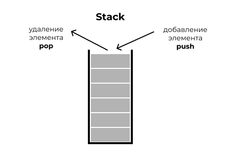
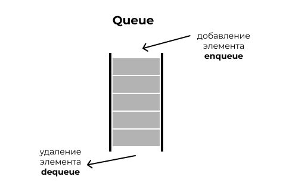

# Очередь и стеки
## Задача: реализовать стек и очередь на массивах и списках.
В данном репозитории представлена реализация структур данных - очередей и стеков на массивах и списках на языке программирования C++.
### Stack
Стек (stack) - это структура данных, в которой добавление и удаление элементов происходит только с одного конца (вершины). Реализация стека на массиве и на списках позволяет эффективно управлять данными.

### Queue
Очередь (queue) - это структура данных, в которой элементы добавляются в конец очереди и извлекаются из её начала. Реализация очереди на массиве и на списках позволяет эффективно управлять данными.

#Реализаця на языке C++
##Реализовано с помощью структур
|структура данных|поля структуры|функция добавления|функция извлечения|
|--------|--------|--------|--------|
|стек на массивах|[stack_mass_pole_struct](./pictures/stack_mass_pole_struct.jpg)|[stack_mass_funct_add](./pictures/stack_mass_funct_add.jpg)|[stack_mass_funct_ex](./pictures/stack_mass_funct_ex.jpg)|
|стек на списках|[stack_list_pole_struct](./pictures/stack_list_pole_struct.jpg)|[stack_list_funct_add](./pictures/stack_list_funct_add.jpg)|[stack_list_funct_ex](./pictures/stack_list_funct_ex.jpg)|
|очередь на массивах|[queue_mass_pole_struct](./pictures/queue_mass_pole_struct.png)|[queue_mass_funct_add](./pictures/queue_mass_funct_add.png)|[queue_mass_funct_ex](./pictures/queue_mass_funct_ex.png)|
|очередь на списках|[queue_list_pole_struct](./pictures/queue_list_pole_struct.png)|[queue_list_funct_add](./pictures/queue_list_funct_add.png)|[queue_list_funct_ex](./pictures/queue_list_funct_ex.jpg)|

